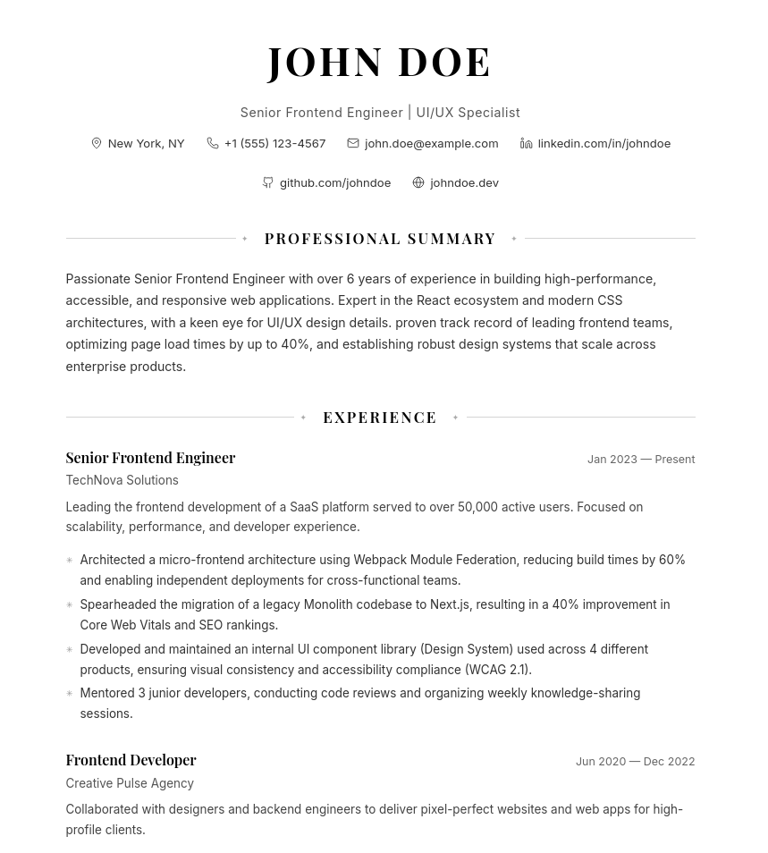
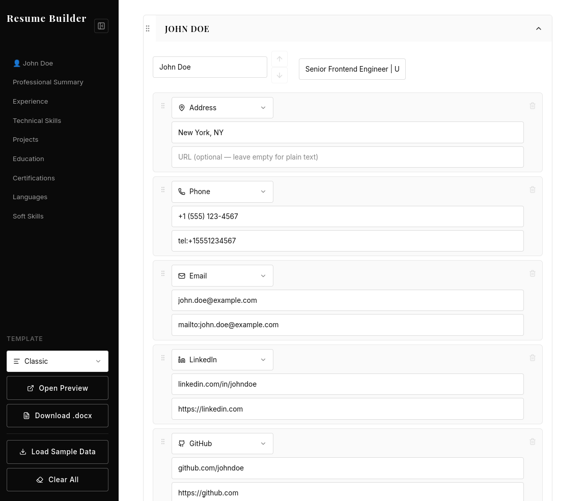

# Resume Builder

A modern, powerful, and highly customizable resume builder application built with **React**, **TypeScript**, and **Vite**. Create professional resumes with real-time previews, drag-and-drop reordering, and instant DOCX export.




## ✨ Features

- **Real-Time Editor**: See changes instantly as you type.
- **Drag-and-Drop**: Easily reorder sections and blocks using `@dnd-kit`.
- **Rich Text Support**: Full rich text editing capabilities powered by `TipTap`.
- **Multiple Templates**:
  - **Classic**: A clean, traditional single-column layout.
  - **Classic Double Column**: A professional two-column design with a dedicated sidebar.
  - **Modern**: A sleek, contemporary look.
  - **Executive**: tailored for senior roles.
- **Professional Icons**: Integrated `Lucide React` icons for contact details and section headers.
- **Export to DOCX**: Download your resume as a perfectly formatted Word document.
- **Local Storage**: Your data is automatically saved to your browser's local storage—never lose your work.
- **Custom Sections**: Add custom sections to fit your unique profile.

## 🛠️ Tech Stack

- **Frontend**: React 19, TypeScript
- **Build Tool**: Vite
- **Styling**: Tailwind CSS, Vanilla CSS
- **State Management**: Zustand
- **Drag & Drop**: @dnd-kit
- **Rich Text Editor**: TipTap
- **Icons**: Lucide React
- **Document Generation**: docx

## 🚀 Getting Started

### Prerequisites

- Node.js (v18 or higher recommended)
- pnpm (or npm/yarn)

### Installation

1.  **Clone the repository:**

    ```bash
    git clone https://github.com/jctree10/resume_builder.git
    cd resume_builder
    ```

2.  **Install dependencies:**

    ```bash
    pnpm install
    # or
    npm install
    ```

3.  **Run the development server:**

    ```bash
    pnpm dev
    # or
    npm run dev
    ```

    Open [http://localhost:5173](http://localhost:5173) to view it in the browser.

### Building for Production

To create a production-ready build:

```bash
pnpm build
```

The output will be in the `dist` directory.

## 📂 Project Structure

```
src/
├── components/       # Reusable UI components
│   ├── editor/       # Editor-specific components (blocks, panels)
├── data/             # Initial state and constants
├── pages/            # Main application pages (EditorPage)
├── store/            # Zustand state management
├── templates/        # Resume templates (Classic, Modern, etc.)
├── types/            # TypeScript type definitions
├── utils/            # Helper functions and DOCX generation logic
├── App.tsx           # Main application entry
└── index.css         # Global styles
```

## 🤝 Contributing

Contributions are welcome! Please feel free to submit a Pull Request.

1.  Fork the project
2.  Create your feature branch (`git checkout -b feature/AmazingFeature`)
3.  Commit your changes (`git commit -m 'Add some AmazingFeature'`)
4.  Push to the branch (`git push origin feature/AmazingFeature`)
5.  Open a Pull Request
